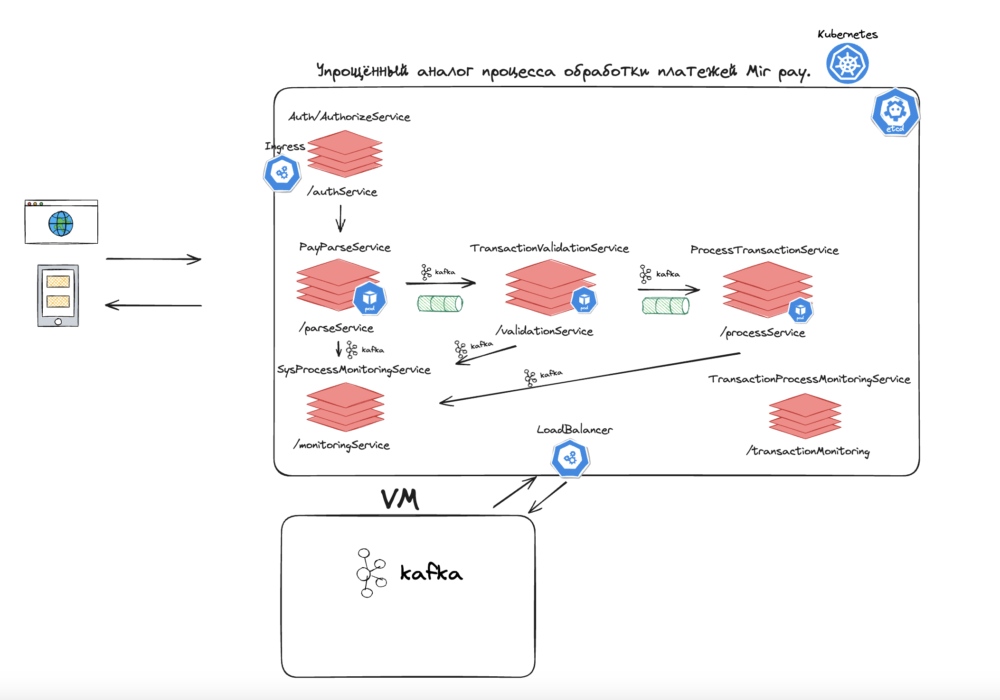

# Описание микросервисов в кластере Kubernetes для приложения Аналог системы Мир Pay (наивная реализация)

## Аутентификация платежей

Сервис аутентификации платежей предоставляет возможность проверки подлинности платежных данных и идентификации клиентов.

### Файлы Kubernetes:

- authentication-service.yml

## Валидация платежей

Сервис валидации платежей осуществляет проверку правильности внесенной информации о платежах и обеспечивает их совместимость с установленными стандартами.

### Файлы Kubernetes:

- validation-service.yaml

## Обработка платежей

Сервис обработки платежей отвечает за выполнение финансовых операций и передачу соответствующих данных между различными банковскими системами.

### Файлы Kubernetes:

- process-service.yaml

## Мониторинг

Сервис мониторинга предоставляет данные о работоспособности и статусе сервисов в реальном времени, а также выполняет сбор метрик для анализа производительности и безопасности системы.

### Файлы Kubernetes:

- monitoring-service.yaml

**Примечание:** Для обеспечения безопасности и надежности сообщений к Kafka вне кластера Kubernetes, используется Load Balancer для балансировки нагрузки и передачи сообщений. Кроме того, для взаимодействия с фронт системами используется Ingress.

### High-level-design архитектура приложения
